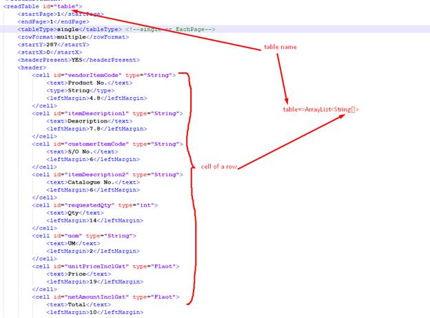

<html>

<head>
<meta http-equiv=Content-Type content="text/html; charset=windows-1252">
<meta name=Generator content="Microsoft Word 15 (filtered)">

</head>

<body lang=EN-US link=blue vlink=purple style='word-wrap:break-word'>

<h2 style='margin-left:.25in;text-indent:-.25in'><a name="_Toc133309302">1.&nbsp;&nbsp;&nbsp;&nbsp; Introduction</a></h2>

PDF Data Ripper is a Java-based
library that can be used with any Java-based application to extract data from
pdf documents. It provides vast flexibility to extract intended information
from the pdf and it includes text information and table information in any part
of the documents. Path to pdf document and instruction file to be provided as
the input and the output will be a data model with all requested information. The
instruction file tells the library how to read the document and what
information should be given as the output. 

.  

<h2 style='margin-left:.25in;text-indent:-.25in'><a name="_Toc133309303">2.&nbsp;&nbsp;&nbsp;&nbsp; Extract
Data</a></h2>

This library support extracting
text from real pdf (digitally created) and does not support scanned pdf. This
provides the following 3 types of extracting methods,

·&nbsp;&nbsp;&nbsp;&nbsp;&nbsp;&nbsp;&nbsp;&nbsp;
Read
by area

·&nbsp;&nbsp;&nbsp;&nbsp;&nbsp;&nbsp;&nbsp;&nbsp;
Read
in document

·&nbsp;&nbsp;&nbsp;&nbsp;&nbsp;&nbsp;&nbsp;&nbsp;
Read
table

<h2 style='margin-left:.55in;text-indent:-.3in'><a name="_Toc133309304">2.1.Read
by area</a></h2>

This function provides the
facility to read content by area (rectangular). Area can be defined by
providing x,y coordinates and the size (width and height). This function
provides two ways of reading,

·&nbsp;&nbsp;&nbsp;&nbsp;&nbsp;&nbsp;&nbsp;&nbsp;
Find
by text

·&nbsp;&nbsp;&nbsp;&nbsp;&nbsp;&nbsp;&nbsp;&nbsp;
Full
text

<h2 style='margin-left:.85in;text-indent:-.35in'><a name="_Toc133309305">2.1.1.&nbsp;&nbsp; Find by text</a></h2>

<a name="_Hlk132146244">It reads
the text inside the defined area line by line and use the provided search text
to locate the relevant text line and then replace the search text, trim
whitespaces in both side of the rest of the text and return as the value.</a>

Figure 01: read by area-find by
text

<h2 style='margin-left:.85in;text-indent:-.35in'><a name="_Toc133309306">2.1.2.&nbsp;&nbsp; Full text</a></h2>

It reads
the full text inside the defined area and return the same text as the output.

Figure 01: read by area-full text

&nbsp;

<h2 style='margin-left:.55in;text-indent:-.3in'><a name="_Toc133309307">2.2.Read
in document</a></h2>

This function provides the
facility to read and search text withing the document and return the complete
line or part of the line. (What to do is defined in the configuration file). Also,
it can be defined the start point to start reading and end point (y) to stop
reading.

content by area (rectangular).
Area can be defined by providing x,y coordinates and the size (width and
height). This function provides two ways of reading,

&nbsp;

<h2 style='margin-left:.55in;text-indent:-.3in'><a name="_Toc133309308">2.3.&nbsp;
Read Table</a></h2>

Reading table data will be a
tricky part and defining correct configuration file will be more important to
read table data correctly. There will be two types of reading namely “single”
or “EachPage”.

Single        -
it is a single table. It may be single page or it may be continued to multiple
pages without header or any other content between page breaks.

EachPage  -
same format of table will repeat on each page. (ex. If header present, each
page has the header and the table in format is same in each page.

Following
requirements has to be full fill by the table to read data correctly,

·&nbsp;&nbsp;&nbsp;&nbsp;&nbsp;&nbsp;&nbsp;&nbsp;
Should
have distinguishable header

·&nbsp;&nbsp;&nbsp;&nbsp;&nbsp;&nbsp;&nbsp;&nbsp;
There
should be one column that can be used to identify the row.

·&nbsp;&nbsp;&nbsp;&nbsp;&nbsp;&nbsp;&nbsp;&nbsp;
Should
provide the header measurement to identify column widths.

&nbsp;

<h2 style='margin-left:.25in;text-indent:-.25in'><a name="_Toc133309309">3.&nbsp;&nbsp;&nbsp;&nbsp; Instruction
file</a></h2>

<a name="_Hlk132543438">This will be a xml file with
pre-defined structure and the extracting data from the pdf document is
completely </a>done based on these instructions.

The file structure can be found in the sample_config folder in the repository

One instruction file can have all types of reading types and
the library will include all values separately in to PDFData object and return.

&nbsp;

Figure 03:
defining read by area -find by text

&nbsp;

Figure 04:
defining read by area – full text

&nbsp;

Figure 05:
defining read in the document

&nbsp;

Figure 06:
defining read table (header present)

&nbsp;

Figure 07: defining
read table (no header)

&nbsp;

&nbsp;

<h2 style='margin-left:.25in;text-indent:-.25in'><a name="_Toc133309310">4.&nbsp;&nbsp;&nbsp;&nbsp; Output
data</a></h2>

The output of the jar module will be a PDFData object that
contain all the details extracted from the PDF according to the instruction
given. Variable names are mapped according to the ids given in the instruction
file. For more details refer the Class documentation.

PDFData object contains HashMap&lt;String,Object&gt; object
called pdf_data and it contains all extracted data. There will be 3 types of
Object,

1.&nbsp;&nbsp;&nbsp;&nbsp;&nbsp; String 

2.&nbsp;&nbsp;&nbsp;&nbsp;&nbsp; HashMap&lt;String,String&gt;

3.&nbsp;&nbsp;&nbsp;&nbsp;&nbsp; PDFTable

<b>String</b>

This will be a direct declaration
of variable in the config file. ID if each element is used as the variable name
&lt;key for HashMap&gt; and the respective extracted string value will be
assigned as the value of HashMap.

Ex: 

cus_address=&gt;customer name,
address line-1,address line 2,160

delivery_address=&gt; delivery
address line1, address line 2, 26542

Code sample:

&nbsp;

<b>HashMap&lt;String,String&gt;</b>

&nbsp;

&nbsp;

po_data=&gt;[

{orderNo=&gt;53020985}

{required_date19/01/21}

{generatedAt=&gt;12/01/21}

{order_by=&gt;John
Doe}

]

Code sample:

&nbsp;

&nbsp;

PDFTable

Table in the PDF document will be
translated in to Table object that consist of multiple TableRow and the
TableRow consist multiple TableCell.

Please fere documentation related
to Table,TableRow,TableCell for more information.

getTableRows() method will return
ArrayList&lt;String[]&gt; of table rows that contain Array if String for a row.

&nbsp;

Sample code: 

&nbsp;

&nbsp;

&nbsp;

contact for more info kumarahhc@gmail.com

</body>

</html>
